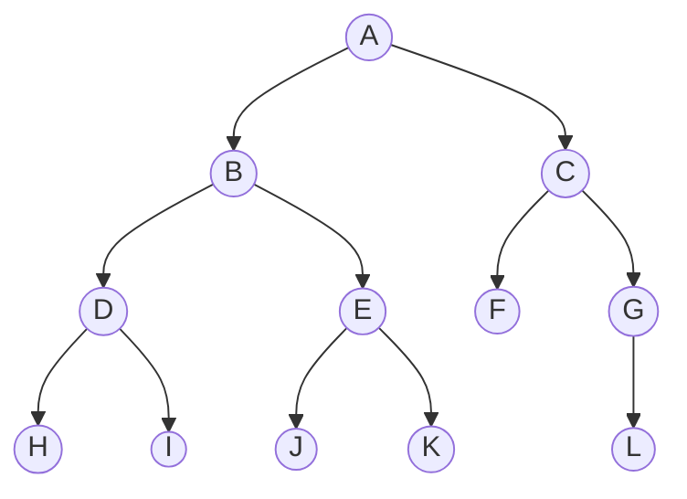

# 树



树由节点和边组成，有唯一根节点。

* ***节点深度***（node depth）

    root到某一个node的路径（是唯一的）所包含的边数，也就是路径长度。例如上图中B的深度是1，F的深度是2，L的深度是3.

* ***节点高度***（node height）

    某个节点的高度是它到其最深子节点的路径长度，例如C的最深子节点是L，C到L的长度是2，所以C的高度就是2。

* ***树高度***（tree height）

    树的高度就是root（A）的高度，A的最深子节点有很多个，以H为例，A到H的路径长度是3，所以A的高度是3，树的高度也是3。

* ***二叉搜索树***（Binary Search Tree，***BST***）

    * `logn`：插入和访问的时间复杂度
    * `left < root < right`：任一节点的值大于左子树中的每个节点值，小于右子树中的每个节点值
    * 根节点一直向左走可得到最小元素
    * 根节点一直向右走可得到最大元素

    ```mermaid
    flowchart TB
        A((17)) --> B((12)) & C((19))
        B --> D((10)) & E((15))
        C --> F((18)) & G((25))
        D --> H((8)) & I((11))
        E --> J((13)) & K((16))
        G --> L((22)) & M((27))
    ```

    

## 二叉树中序遍历（94）

左子树---根节点---右子树顺序访问，对于左子树和右子树用同样的顺序访问，直到遍历完整棵树。整个遍历过程有天然递归性质，定义一个递归函数`inorder(root)`表示当前遍历到root节点的答案，我们只需要递归调用`inorder(root.left)`可以得到左子树中序遍历结果，`inorder(root.right)`得到右子树遍历结果，然后将`root.val`插入两个结果当中即可。

递归终止条件是碰到空节点。

### 递归

```C++
void inorder(TreeNode* root,vector<int> &res)
{
    if(!root)
        return;
    
    inorder(root->left.res);
    res.push_back(root->val);
    inorder(root->right.res);
}

vector<int> inorderTraversal(TreeNode* root)
{
    vector<int> res;
    inorder(root,res);
    return res;
}
```

时间复杂度：`O(n)`，n为二叉树节点个数。

空间复杂度：`O(n)`，空间复杂度取决于递归的栈深度，栈深度在二叉树为一条链的极端情况下会达到`O(n)`级别。


### 非递归（迭代）


## 二叉树前序遍历（144）


## 二叉树后序遍历（145）


## 相同的树（100）


## 对称二叉树（101）


## 二叉树最大深度（104）


## 有序数组转为二叉搜索树（108）


## 平衡二叉树（110）


## 二叉树最小深度（111）


## 路径总和（112）


## 翻转二叉树（226）


## 二叉搜索树的最近公共祖先（235）


## 二叉树的所有路径（257）


## 左叶子之和（404）


## 二叉搜索树中的众数（501）


## 二叉搜索树的最小绝对差（530）


## 二叉树的直径（543）


## N叉树的最大深度（559）


## 二叉树的坡度（563）


## 另一棵树的子树（572）


## N叉树的前序遍历（589）


## N叉树的后序遍历（590）


